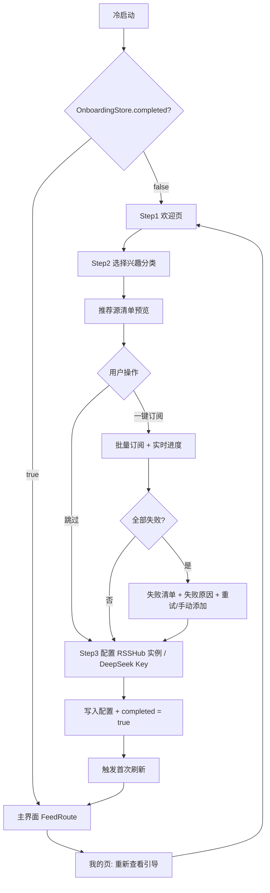

# 需求文档：首次使用引导（Onboarding）

- **项目**：RssRadar（Android RSS 阅读器，RSSHub-centric）
- **模式**：敏捷模式（Epic → User Story → 验收标准）
- **版本**：**v1.1（定稿）**
- **日期**：2026-09-06
- **状态**：已定稿，可直接用于开发评审与 issue 拆分

---

## 1. 背景与目标

### 1.1 现状（代码核查结论，非臆测）

| 事实 | 证据 |
|------|------|
| 无任何 onboarding 代码 | 全仓 grep `onboard\|firstRun\|welcome` 零命中（命中的「引导」全是 AI 功能空态文案） |
| 启动即进主界面 | `MainActivity` → `NavHost(startDestination = FeedRoute)` |
| 新用户兜底只有空态 | `FeedListScreen.EmptyState` 提供「添加订阅源 / 导入 OPML」两个入口 |
| 偏好存储成本极低 | `core/data/.../store/` 已有 15 个 Store，统一吃 SharedPreferences，Hilt 在 `AppModule` provides |
| RSSHub 实例可切换 | `RssHubRoutes.DEFAULT_HOST` + `RssHubInstanceStore`，设置页可改 |
| AI 需 Key 才可用 | `AiStore` 存 DeepSeek Key；未配置时功能是灰的 |
| 通知权限无全局引导 | `POST_NOTIFICATIONS` 只在设置二级页开启通知时才请求 |
| **路由目录自带分类与热度** | `RssHubRoute` 含 `categories: List<String>`、`heat: Long`、`examples: List<RouteExample>`；`RouteCategory` 提供 24 个分类常量 + `label()` 中文映射 + `ORDER` 排序 |
| **分类检索是现成纯函数** | `RouteCatalogQuery.search(routes, query, category)`：按分类过滤 + 热度降序，上限 200 条，不联网不碰 Android API |
| **示例路由可直接订阅** | `RouteExample.path` 是**已填好参数的相对路径**（如 `/bilibili/user/video/2267573`），拼 host 即用，无需用户填参 |

**核心问题**：新用户装完直接掉进空列表，靠空态文案自解释。RSSHub-centric 的产品里，「加第一个源」的门槛（要知道 RSSHub 是什么、要拼路由 URL）远高于普通 RSS 阅读器。

### 1.2 目标

1. 新用户 60 秒内完成「选兴趣 → 有内容可读」，不依赖理解 RSSHub 概念。
2. 引导过程全程可跳过，不制造卸载理由。
3. 顺带完成两项关键配置落位（RSSHub 实例、DeepSeek Key），但不作为必经门槛。

### 1.3 范围外（明确不做）

- 第三方账号 / 同步服务接入
- 引导内请求通知权限、电池优化白名单
- 个性化推荐算法（本版为静态分类 + 按热度取现成示例路由）

---

## 2. 业务流程

### 2.1 主流程

### 2.2 异常分支

| 分支 | 触发条件 | 处理 |
|------|---------|------|
| E1 网络不可用 | 批量订阅时无网络 | 每个源返回 `AddFeedResult.NetworkError`，汇总展示「网络不可用」，提供「重试」「稍后在订阅页添加」，**不阻塞进入主界面** |
| E2 部分源失效 | RSSHub 路由冷启动超时 | 成功/失败分开计数，失败列出源名 + 原因；成功的源正常入库 |
| E3 用户中途返回 | 第二步按返回键 | 回上一步且保留已选项；第一步按返回键 = 退出应用（不进主界面） |
| E4 Key 格式错误 | DeepSeek Key 校验失败 | 明确提示原因，允许留空跳过；**Key 不写入日志** |
| E5 实例探测失败 | 选择的镜像不可达 | 回退默认官方实例并告知，不阻断流程 |
| E6 目录未加载完成 | 进入 Step2 时 `RouteCatalogStore.catalog` 仍为 null | 展示加载态并 `await` 内置快照（`load()` 走 IO 读 assets，通常百毫秒级）；超时 3s 则降级为「手动添加 / 导入 OPML」两个入口 |

### 2.3 可行性分析

| 维度 | 结论 | 说明 |
|------|------|------|
| 技术可行性 | **高** | 订阅（`SubscriptionFlow.addFeed`）、实例切换（`RssHubInstanceStore`）、Key 存储（`AiStore`）、分类检索（`RouteCatalogQuery.search`）全部现成，引导层只做编排 + UI |
| 业务可行性 | **高** | 直击「空列表 + 不懂 RSSHub」双重门槛，与产品 RSSHub-centric 定位一致 |
| 资源可行性 | **高**（原评「中」，v1.1 上调） | 原担忧的「推荐源数据准备」不成立——分类、热度、可直接订阅的示例路由**全部已在内置目录里**，数据驱动零维护。唯一新增成本是批量订阅的并发改造 |
| 主要风险 | — | ① 公共 RSSHub 实例限流/不稳定会导致引导首屏就失败，体验反而更差 → 单源超时 + 整体超时 + 失败可重试；② 内置目录里的示例路由可能失效（目录快照有滞后）→ 订阅失败必须如实展示，不假装成功 |

---

## 3. 需求拆解（敏捷模式）

### Epic 1：引导流程框架

#### Story 1.1 引导容器与分步导航
**作为**新用户，**我希望**首次打开时进入一个分步骤的引导流程，**以便**我知道接下来要做什么、做到哪一步。
- 优先级：**P0** ｜ 工作量：**M**

**验收标准**
- **Given** 全新安装（`onboarding_completed = false`）——**When** 冷启动——**Then** 直接渲染引导页首帧，**不闪现** Feed 空列表
- **Given** 已完成引导——**When** 冷启动——**Then** 直接进 `FeedRoute`，引导页**不进入返回栈**（返回键不会退回引导）
- **Given** 老版本升级且库中已有订阅源——**When** 首次启动新版本——**Then** 视为已完成，**不弹引导**
- **Given** 处于引导第 N 步（N>1）——**When** 按返回键——**Then** 回到第 N-1 步且**已选项不丢失**
- **Given** 处于引导第 1 步——**When** 按返回键——**Then** 退出应用（不进主界面）
- **Given** 任何一步——**When** 查看顶部——**Then** 显示步骤指示器（当前步 / 总步数）

#### Story 1.2 全程可跳过
**作为**不想被引导的用户，**我希望**每一步都能直接跳过，**以便**我立刻开始自己摸索。
- 优先级：**P0** ｜ 工作量：**S**

**验收标准**
- **Given** 任意一步——**When** 点击「跳过」——**Then** 写入 `onboarding_completed = true` 并进入主界面，等价于「跳过全部配置」
- **Given** 用户点了跳过——**When** 再次冷启动——**Then** 不再出现引导
- **Given** 用户跳过——**Then** 记录 `onboarding_skipped_at` 时间戳（用于后续判断是否需要二次引导）

---

### Epic 2：兴趣选择与推荐源订阅

> **数据来源约定（三个 Story 共用）**：推荐源**不人工维护清单**，全部来自内置路由目录的实时查询——
> `RouteCatalogQuery.search(catalog.routes, query = "", category = key)` 取热度 Top N，
> 再对每条路由按下列规则解析出可订阅的相对路径：
> 1. `requiredParams` 为空 → 用 `route.path` 本身（无参路由，如 `/zhihu/daily`）
> 2. 否则取 `examples.firstOrNull()?.path`（已填好参数的示例）
> 3. 两者都取不到 → **不可一键订阅，从清单中剔除**
>
> 展示名优先级：`RouteExample.title` → `route.name` → `route.sourceName`。
> **最终订阅 URL = 当前 host + 相对 path**（见 Story 3.1 的 host 约束）。

#### Story 2.1 兴趣分类展示与勾选
**作为**新用户，**我希望**通过勾选感兴趣的领域来获得推荐订阅源，**以便**我不用自己研究 RSSHub 路由怎么拼。
- 优先级：**P0** ｜ 工作量：**S**（数据现成，工作量从 M 下调）

**验收标准**
- **Given** 进入兴趣选择步——**When** 页面渲染完成——**Then** 从 `RouteCategory.ORDER` 中取预设的 8 个主分类（热门 / 社交媒体 / 新媒体 / 编程 / 视频 / 游戏 / 阅读 / 财经），用 `RouteCategory.label(key)` 展示中文名
- **Given** 用户勾选/取消分类——**When** 状态变化——**Then** 已选数量实时反映在「下一步」按钮上（如「查看 12 个推荐源」）
- **Given** 一个分类都没选——**When** 点击下一步——**Then** 按钮置灰并给出解释文案「至少选择一个分类，或直接跳过」（**遵循项目 UI 铁律：disabled 按钮必须配解释文案**）
- **Given** 目录未加载完成——**When** 进入此步——**Then** 展示加载态；超过 3s 未完成则降级为「手动添加 / 导入 OPML」入口（对应异常分支 E6）

#### Story 2.2 推荐源清单预览与微调
**作为**新用户，**我希望**在订阅前看到会添加哪些源并可以取消个别源，**以便**我不会被动订阅一堆不想要的内容。
- 优先级：**P1** ｜ 工作量：**S**（数据现成，工作量从 M 下调）

**验收标准**
- **Given** 已选分类——**When** 进入清单预览——**Then** 各分类分别取热度 Top 5，合并去重后默认全选；每行展示**名称 + 来源站点名（`sourceName`）**
- **Given** 用户在清单里取消某个源——**When** 返回或前进——**Then** 该源不参与批量订阅，计数同步更新
- **Given** 用户修改分类勾选——**When** 返回清单——**Then** 清单按新分类重算（已取消的源若仍在分类内，恢复为选中）
- **Given** 某条路由无可用 path（见数据来源约定第 3 条）——**Then** 不出现在清单里，不占位、不报错

#### Story 2.3 一键批量订阅
**作为**新用户，**我希望**点一次就把选中的源全部订阅好，**以便**我立刻有内容可读。
- 优先级：**P0** ｜ 工作量：**M**

**验收标准**
- **Given** 已确认源清单（N 个）——**When** 点击「一键订阅」——**Then** **并发**调用 `SubscriptionFlow.addFeed(host + path)`（并发上限 8，与 `REFRESH_CONCURRENCY` 解耦但同量级），实时显示「已完成 X / N」
- **Given** 某个源订阅失败——**When** 批量结束——**Then** 汇总展示：成功 N 个 / 失败 M 个；失败项列出**源名 + 具体原因**（`InvalidFeed` / `NetworkError` / `Duplicate` 转中文）
- **Given** 全部失败——**When** 批量结束——**Then** 提供「重试」和「手动添加」两个出口，**不阻塞进入主界面**
- **Given** 批量进行中——**When** 用户按返回键——**Then** 提示「正在订阅，退出将保留已完成的 N 个源」，确认后才退出（已入库的源不回滚）
- **Given** 单个源超过 20s 未响应——**When** 超时——**Then** 该源标记为失败并继续下一个，不拖垮整批
- **Given** 整批超过 30s——**When** 超时——**Then** 剩余源转入后台继续，用户先进入主界面
- **Given** 订阅分组——**Then** 使用 `RssHubRoute.suggestedGroup(categories)`（开发 / 设计 / 科技），与手动添加路由时的分组逻辑保持一致

#### Story 2.4 订阅完成后触发首次刷新
**作为**新用户，**我希望**订阅完就能看到文章，**以便**不用再手动下拉刷新。
- 优先级：**P1** ｜ 工作量：**S**

**验收标准**
- **Given** 批量订阅成功至少 1 个源——**When** 进入主界面——**Then** 自动触发一次刷新（复用现有 `SyncWorker` / `RefreshEngine`），Feed 列表显示加载态而非空白
- **Given** 刷新失败——**When** 失败——**Then** Feed 空态展示失败原因 + 「重试」CTA（复用现有空态组件逻辑）

---

### Epic 3：关键配置初始化

#### Story 3.1 RSSHub 实例选择
**作为**进阶用户，**我希望**在引导里就能选 RSSHub 实例，**以便**我不必事后去设置页翻。
- 优先级：**P1** ｜ 工作量：**M**

**验收标准**
- **Given** 进入配置步——**When** 页面渲染——**Then** 默认选中官方实例（`RssHubRoutes.DEFAULT_HOST`），并提供内置镜像候选
- **Given** 用户选择某个实例——**When** 点击下一步——**Then** 写入 `RssHubInstanceStore`；**若此时已订阅的推荐源是用旧 host 拼的，必须按新 host 重新入库**（或强制本步先于订阅步执行，见 §6 矛盾 3 的消解方案）
- **Given** 选择的实例探测不可达——**When** 探测失败——**Then** 回退默认实例并明确告知，不阻断流程
- **Given** 用户跳过此步——**Then** 使用默认实例，不做任何写入

#### Story 3.2 DeepSeek Key 选填
**作为**想用 AI 功能的用户，**我希望**在引导里就能填 DeepSeek Key，**以便**进入后 AI 摘要/翻译直接可用。
- 优先级：**P2** ｜ 工作量：**S**

**验收标准**
- **Given** 进入配置步——**When** 查看 Key 输入区——**Then** 明确标注「选填，可稍后在设置里填」，并提供跳转设置页入口
- **Given** 用户填写 Key 并完成——**Then** 写入 `AiStore`，AI 功能默认可用
- **Given** Key 为空或格式错误——**When** 点击完成——**Then** 给出明确原因提示，允许留空跳过；**Key 全程不写入日志、不进崩溃上报**
- **Given** 用户跳过——**Then** AI 功能保持灰色，入口给出「去设置配置 Key」的引导（复用现有 `AiArticleSheet` 的灰色引导逻辑）

---

### Epic 4：可回访与兜底

#### Story 4.1 设置页重看引导入口
**作为**已跳过的用户，**我希望**能主动再看一次引导，**以便**我后来想补配置时能找到路。
- 优先级：**P1** ｜ 工作量：**S**

**验收标准**
- **Given** 用户在「我的」页——**When** 滚动到底部——**Then** 存在「新手引导」入口
- **Given** 用户点击该入口——**When** 引导打开——**Then** 从 Step1 开始，**不重置已有订阅源**
- **Given** 用户重看后完成——**Then** 只更新配置类选择（实例 / Key），已有数据不受影响

#### Story 4.2 引导与空态的边界
**作为**用户，**我希望**引导和空态不要给我两套重复入口，**以便**界面不啰嗦。
- 优先级：**P2** ｜ 工作量：**S**

**验收标准**
- **Given** 用户跳过引导进入主界面且无任何源——**Then** Feed 空态保持现有「添加订阅源 / 导入 OPML」双入口，**不新增引导专属入口**
- **Given** 用户完成引导但 0 个源订阅成功——**Then** 进入主界面后由空态接管，空态文案与引导失败提示**不重复出现**

#### Story 4.3 无障碍与动效降级
**作为**无障碍用户，**我希望**引导页能被读屏和降低动效设置正确处理。
- 优先级：**P2** ｜ 工作量：**S**

**验收标准**
- **Given** 开启 TalkBack——**When** 遍历引导页——**Then** 所有可点击元素有内容描述，步骤变化有可读提示
- **Given** 开启「减少动效」——**When** 翻页——**Then** 动画为 `EnterTransition.None`（复用 `LocalReducedMotion` + `MotionTokens`）
- **Given** 深色主题 / 横屏 / 折叠屏展开——**Then** 布局不裁切、不溢出

---

## 4. 非功能需求

### 性能要求
- 冷启动到引导页首帧 ≤ 800ms
- 目录内置快照加载（`RouteCatalogStore.load()`）> 3s 时降级（见 E6）
- 批量订阅 20 个源：良好网络下总耗时 ≤ 15s；弱网按 Story 2.3 超时策略降级
- 引导页不阻塞主线程：订阅走 IO 调度器（现有 `SubscriptionFlow` 已 `withContext(ioDispatcher)`）

### 安全要求
- DeepSeek Key 不写日志、不进崩溃上报、不随备份导出
- 推荐源 URL 只用相对 route path 拼装，不硬编码用户实例域名

### 兼容性要求
- minSdk 31 / targetSdk 37（与项目一致）
- 深色主题、横屏、折叠屏适配

### 可用性要求
- **全流程可跳过**（沿用项目 UI 铁律）
- **任何失败必须有可见原因**：批量订阅失败、实例探测失败、Key 校验失败、目录加载超时一律给出中文原因 + 下一步出口
- **数字与结果必须真实**：订阅成功/失败数来自 `AddFeedResult` 实际返回，不做乐观预估、不假装成功

---

## 5. 优先级合理性检查

| 优先级 | 数量 | 占比 |
|--------|------|------|
| P0 | 4 | **36%** |
| P1 | 4 | 36% |
| P2 | 3 | 27% |
| 合计 | 11 | 100% |

> P0 占比 36%，落在「可接受但需关注」区间（30%–40%），未触发硬上限（40%）。
> v1.1 因数据现成，Story 2.1 / 2.2 工作量从 M 降至 S，整体排期压力下降，P0 占比维持不变即可。

**P0 清单**：1.1 引导容器与分步导航、1.2 全程可跳过、2.1 兴趣分类展示与勾选、2.3 一键批量订阅

---

## 6. 需求矛盾检测报告

| 序号 | 矛盾类型 | 涉及需求 | 矛盾描述 | 处理方式 |
|------|---------|---------|---------|------------|
| 1 | 功能冲突 | 定位「配置型强落地」 vs Story 1.2 全程可跳过 | 两者目标相反：一个要用户配完，一个允许什么都不配 | **已消解**：跳过 = 跳过配置，但兴趣步用「至少选一个才下一步」的软约束引导；跳过与完成都写 `completed`，只是数据结果不同 |
| 2 | 功能与非功能冲突 | Story 2.3 批量订阅 vs 性能要求（≤15s / 20 源） | 现有 `addFeed` 是**串行逐个联网校验**，20 个源串行必然超时 | **已解决**：并发上限 8 + 单源 20s 超时 + 整体 30s 转后台，已写入 Story 2.3 AC |
| 3 | 数据约束冲突 | Story 2.3 推荐源 vs Story 3.1 实例可切换 | 若推荐源存绝对 URL，用户在引导里换了实例后，推荐源仍指向旧 host，实例选择形同虚设 | **已解决**：推荐源只存相对 path；**并把实例选择步前置于订阅步**（Step2 选实例 → Step3 选兴趣 → Step4 订阅），从流程上彻底消除 host 不一致 |
| 4 | 数据约束冲突 | Story 2.1 兴趣分类 vs `RouteCatalog` 数据结构 | 兴趣分类依赖路由目录带分类字段 | **v1.1 已核实消除**：`RssHubRoute.categories` + `RouteCategory`（24 分类 + `label()` + `ORDER`）全部现成，无需人工映射表 |
| 5 | 互斥需求优先级冲突 | Story 4.2 空态边界 vs Story 4.1 重看入口 | 可能出现两套「添加源」入口 | **已消解**：重看入口在「我的」页底部，空态入口在 Feed 页，不同页面不冲突 |

> **结论**：5 项矛盾全部闭环，无遗留阻塞项。矛盾 3 的解决方案触发了**流程顺序调整**（见 §12 交互说明的最终步骤顺序）。

---

## 7. 需求追溯矩阵

| 流程节点 | 节点描述 | 关联 Story | 覆盖状态 |
|---------|---------|-----------|---------|
| A | 冷启动 | 1.1 | ✅ |
| B | 判断 `onboarding_completed` | 1.1 | ✅ |
| C | Step1 欢迎页 | 1.1 | ✅ |
| D | Step2 选择兴趣分类 | 2.1 | ✅ |
| E | 推荐源清单预览 | 2.2 | ✅ |
| F | 用户操作分支（订阅 / 跳过） | 1.2、2.3 | ✅ |
| G | 批量订阅 + 实时进度 | 2.3 | ✅ |
| H | 是否全部失败 | 2.3 | ✅ |
| I | 失败清单 + 重试/手动添加 | 2.3 | ✅ |
| J | Step3 配置 RSSHub 实例 / DeepSeek Key | 3.1、3.2 | ✅ |
| K | 写入配置 + `completed = true` | 1.1、1.2、3.1、3.2 | ✅ |
| L | 触发首次刷新 | 2.4 | ✅ |
| Z | 主界面 FeedRoute | 1.1、4.2 | ✅ |
| M | 我的页「重新查看引导」 | 4.1 | ✅ |

**流程覆盖率：14/14 = 100% ✅**

**反向检查**：11 个 Story 全部可追溯至至少一个流程节点，无孤儿需求。Story 4.3 为横切非功能质量项（无障碍/动效），不对应具体流程节点，保留。

---

## 8. 已消除的假设（v1.1 核实结果）

| 编号 | v1.0 假设 | 核实结论 |
|------|----------|---------|
| A1 | `RouteCatalog` 是否含分类字段 | ✅ **已确认**：`RssHubRoute.categories` + `RouteCategory`（24 分类 + `label()` + `ORDER`）。无需人工映射表 |
| A2 | 推荐源需人工挑选 30–60 条 | ✅ **已消解**：改为按分类 + 热度动态取 `examples`，数据驱动零维护。清单规模 = 每分类 Top 5 |

## 8.1 仍待确认

| 编号 | 待确认内容 | 影响 | 建议 |
|------|-----------|------|------|
| B1 | 8 个主分类的具体选择（热门/社交媒体/新媒体/编程/视频/游戏/阅读/财经） | 影响首屏命中率 | 先按建议值实现，灰度后按实际订阅转化率调整 |
| B2 | 每分类取 Top 5 是否合适 | 清单过长会拖慢批量订阅 | 建议首版 5，实测后调 |
| B3 | 批量订阅并发上限 8 | 公共 RSSHub 实例可能限流 | 首版取 8，实测后调 |
| B4 | 本版不请求通知权限 / 电池优化白名单 | 自动同步仍可能被系统限制 | 已知缺口，接受 |

---

## 9. 工作量汇总

| 尺寸 | 数量 | Story |
|------|------|-------|
| S | 7 | 1.2、2.1、2.2、2.4、3.2、4.1、4.3 |
| M | 4 | 1.1、2.3、3.1、4.2 |
| L | 0 | — |
| 合计 | 11 | 预估 **6–10 人日**（v1.1 下调，因推荐源数据零准备成本） |

> 无 XL，颗粒度合理，可直接拆 issue。

---

## 10. 术语表

| 术语 | 含义 |
|------|------|
| Onboarding / 引导 | 首次安装后的一次性配置流程 |
| 推荐源 | 由内置路由目录按「所选分类 + 热度」动态解析出的可订阅路由 |
| route path | RSSHub 路由的相对路径（如 `/bilibili/user/video/2267573`），与 host 分离存储 |
| 实例 / host | RSSHub 服务地址，默认 `https://rsshub.app`，用户可切换镜像 |
| AddFeedResult | `SubscriptionFlow.addFeed` 返回：`Success` / `InvalidFeed` / `NetworkError` / `Duplicate` |
| completed | `OnboardingStore` 中的完成标记，决定后续启动是否再弹引导 |

---

## 11. Issue 拆分与依赖顺序

已建 issue（依赖边用 GitHub 原生 dependencies 建立）：

| Issue | 内容 | Blocked by | 预估 |
|-------|------|-----------|------|
| **#85** | `OnboardingStore` + 引导路由接入 + 分步容器 + 全程跳过（Story 1.1 / 1.2） | — | M |
| **#86** | Story 2.1 兴趣分类展示与勾选（复用 `RouteCategory`） | #85 | S |
| **#87** | Story 2.2 推荐源清单预览与微调 | #86 | S |
| **#88** | Story 2.3 一键批量订阅（并发改造 + 超时降级） | #85、#87 | M |
| **#89** | Story 2.4 订阅后触发首次刷新 | #88 | S |
| **#90** | Story 3.1 RSSHub 实例选择（Step2，**前置**） | #85 | M |
| **#91** | Story 3.2 DeepSeek Key 选填（Step4） | #85 | S |
| **#92** | Story 4.1 / 4.2 / 4.3 重看入口 + 空态边界 + 无障碍 | #85 | S |

> #86/#87 与 #90/#91 可并行；**#88 是唯一有技术改造风险的一项**（并发 + 超时）。
> 建议起手顺序：#85 → #90（实例，因为要前置）→ #86 → #87 → #88 → #89。

---

## 12. 交互说明

### 12.1 最终步骤顺序（因矛盾 3 调整）

| 步骤 | 内容 | 可跳过 |
|------|------|--------|
| Step 1 / 4 | 欢迎页：RssRadar 是什么 + RSSHub 一句话解释 | 是 |
| Step 2 / 4 | RSSHub 实例选择（默认官方，可换镜像） | 是 |
| Step 3 / 4 | 兴趣分类勾选 → 推荐源清单预览 → 一键订阅 | 是 |
| Step 4 / 4 | DeepSeek Key 选填 → 完成 | 是 |

> **顺序理由**：实例必须先定，推荐源 URL 才能用正确 host 拼装（矛盾 3）。Key 放最后，因为它最不影响「有内容可读」这个首要目标。

### 12.2 关键交互细节

- **步骤指示器**：顶部横向圆点 + 「第 N 步 / 共 4 步」文字，TalkBack 可读
- **翻页动效**：横向滑动 280ms emphasized（与项目 `docs/motion.md` 一致）；`reduce-motion` 下为瞬时切换
- **订阅进度**：不可关闭的进度条 + 「已完成 X / N」+ 当前源名；不允许静默长等待
- **失败展示**：失败项可展开，显示源名 + 中文原因；底部固定「重试」「手动添加」两个按钮
- **跳过入口**：右上角文字按钮「跳过」，不做二次确认（降低摩擦）
- **按钮禁用**：未选分类时「下一步」置灰并在按钮下方显示原因文案

### 12.3 状态持久化

`OnboardingStore`（SharedPreferences，命名前缀 `onboarding_`）：

| Key | 类型 | 说明 |
|-----|------|------|
| `onboarding_completed` | Boolean | 是否完成/跳过引导 |
| `onboarding_skipped_at` | Long? | 跳过时间戳，null 表示未跳过 |
| `onboarding_version` | Int | 引导版本，用于未来改版后重新引导 |

---

## 变更日志

| 版本 | 日期 | 变更内容 |
|------|------|---------|
| v1.0 | 2026-09-06 | 初始版本。基于代码事实核查 + 用户四项决策（敏捷模式 / 配置型引导 / 首次启动可跳过 / 推荐源一键订阅）输出 |
| v1.1 | 2026-09-06 | 定稿。① 核实并消除 A1/A2 假设——推荐源改为由 `RouteCategory` + `RouteCatalogQuery` + `examples` 数据驱动，零人工维护；② 矛盾 3 的解决方案触发步骤顺序调整（实例步前置）；③ 新增异常分支 E6（目录未加载）；④ Story 2.1/2.2 工作量 M→S，总工作量 8–13 → 6–10 人日；⑤ 补交互说明（§12）与状态持久化设计 |
