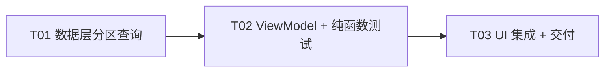

# 架构设计：RssRadar 内容分区（Views）一期

> 依据：`deliverables/software-company/prd-content-views.md`（方案 C）+ 实际代码事实。
> 基线：issue #74（分组筛选下沉 DB）**已提交**后的 dev 分支；本功能是在其上的增量叠加，**不动 #74 工作区未提交改动**。
> 遵守：MVI（ADR-0003）、列表查询走 `ARTICLE_LIST_COLUMNS`、ORDER BY 零表达式、`@Suppress("QUERY_MISMATCH")`、禁止 gradle 编译。

---

## 1. 实现方案

### 1.1 核心思路

分区 = 第二个可叠加的 DB 级过滤维度。与 #74 的分组筛选完全同构：

- **状态**：`FeedListUiState` 增加 `selectedContentType: ContentTypeFilter`（null 语义由枚举 `All` 承担）。
- **查询**：在分组 WHERE 之上叠加 `feeds.contentType` 条件，「全部」= 不加条件（零开销）。
- **推荐流**：推荐序在内存里，沿用 #74 的 `filterByGroup` 模式增加 `filterByContentType`（轻量 id→contentType 查询 + 纯函数过滤）。
- **空分区空态**：选中某类型但库里没有任何该类型订阅源时，`EmptyState` 走专用分支。
- **画廊不下放主页、类型修正沿用 FeedActionScreen、无 DB 迁移**（version 保持 13）。

### 1.2 DAO 查询形态（关键决策：合成变体，不笛卡尔积）

**不新增** 4 条「分组 × 类型」笛卡尔积变体。做法：把 #74 的 4 条 `loadXXXWithFeedPagedByGroup` **升级为** 4 条 `loadXXXWithFeedPagedFiltered`（改名 + 加一个 nullable 参数），分组、类型两个条件收进同一条查询。DAO 查询总数不变（4 条无条件 + 4 条组合条件）。

`AppDatabase.kt`（`ArticleDao` 区域）新增谓词常量：

```kotlin
/**
 * 内容分区（内容类型过滤）的 WHERE 片段：选中分区时按 feeds.contentType 过滤。
 * 「全部」分区 = :contentType 传 null，谓词恒真，不加过滤开销（与 GROUP_FILTER_PREDICATE 同一思路）。
 * 绑定参数由仓库层从 UI 枚举换算（ContentTypeFilter.dbValue），DAO 不依赖 UI 类型。
 */
private const val CONTENT_TYPE_FILTER_PREDICATE =
    "(:contentType IS NULL OR feeds.contentType = :contentType)"
```

并把分组谓词改为可空版本（`GROUP_FILTER_PREDICATE` 原文保留语义，新增空组短路）：

```kotlin
private const val GROUP_FILTER_PREDICATE_NULLABLE =
    "(:group IS NULL OR (feeds.groupName = :group OR (:isDefaultGroup = 1 AND feeds.groupName = '')))"
```

组合变体查询（四个常规 tab 各一条，以 All tab 为例；其余三条把 tab 自身的 WHERE 换成 `articles.isRead = 0 AND` / `articles.isStarred = 1 AND` / `articles.isBookmarked = 1 AND`）：

```kotlin
@Query(
    """
    SELECT $ARTICLE_LIST_COLUMNS, feeds.title AS feedTitle, feeds.groupName AS feedGroup, feeds.iconUrl AS feedIconUrl
    FROM articles
    JOIN feeds ON articles.feedId = feeds.id
    WHERE $GROUP_FILTER_PREDICATE_NULLABLE AND $CONTENT_TYPE_FILTER_PREDICATE
    ORDER BY articles.publishedAt DESC, articles.fetchedAt DESC
    LIMIT :limit OFFSET :offset
    """,
)
@Suppress("QUERY_MISMATCH")
suspend fun loadAllWithFeedPagedFiltered(
    group: String?,
    isDefaultGroup: Boolean,
    contentType: Int?,
    limit: Int,
    offset: Int,
): List<ArticleWithFeed>
```

要点：
- `ARTICLE_LIST_COLUMNS` 原样复用，不新增任何文章列 → 无 OOM 面变化、无 schema 变化。
- ORDER BY 与现有四条完全一致，走 `index_articles_publishedAt_fetchedAt`，排序表达式零新增；新谓词只作用于 JOIN 探测行，不会退化成全表外排序。
- Room 对 `:group IS NULL`（String?）/ `:contentType IS NULL`（Int?）的 nullable 绑定是成熟模式，无需任何 hack。

新增两条轻量辅助查询（同文件）：

```kotlin
/** 空分区空态判定：是否存在该内容类型的订阅源。 */
@Query("SELECT COUNT(*) FROM feeds WHERE contentType = :contentType")
suspend fun countFeedsByContentType(contentType: Int): Int

/** 文章 id → 所属源的 contentType（推荐流按分区过滤推荐序用，两列轻量，模式同 groupOfArticles）。 */
@Query(
    """
    SELECT articles.id AS id, feeds.contentType AS contentType
    FROM articles
    JOIN feeds ON articles.feedId = feeds.id
    WHERE articles.id IN (:ids)
    """,
)
suspend fun contentTypeOfArticles(ids: List<Long>): List<ArticleIdContentType>
```

```kotlin
/** 文章 id 与所属源内容类型的轻量对（推荐流按分区过滤推荐序用）。 */
data class ArticleIdContentType(val id: Long, val contentType: Int)
```

### 1.3 Repository API（`FeedRepository.kt`）

把 4 条 `loadXXXPageByGroup` **替换为** 4 条组合入口（#74 已提交基线上的正常后续演进，无分支冲突）：

```kotlin
/**
 * 组合过滤分页：分组（null=全部，含默认组空串语义）× 内容分区（null=全部）叠加。
 * 两个过滤都为空时走无谓词的原查询，不为空才进组合查询——「全部」不加过滤开销。
 * isDefaultGroup 在这里统一判定（group == DEFAULT_GROUP），DAO 不做字符串比较。
 */
suspend fun loadArticlesPageFiltered(group: String?, contentType: Int?, limit: Int, offset: Int): List<ArticleWithFeed> =
    if (group == null && contentType == null) articleDao.loadAllWithFeedPaged(limit, offset)
    else articleDao.loadAllWithFeedPagedFiltered(group, group == DEFAULT_GROUP, contentType, limit, offset)

suspend fun loadUnreadPageFiltered(...)     // 同构，走 loadUnreadWithFeedPaged / loadUnreadWithFeedPagedFiltered
suspend fun loadStarredPageFiltered(...)    // 同构
suspend fun loadBookmarkedPageFiltered(...) // 同构

/** 空分区空态判定：是否有任何该类型订阅源。 */
suspend fun hasFeedsOfType(contentType: Int): Boolean =
    feedDao.countFeedsByContentType(contentType) > 0
```

### 1.4 推荐流分区过滤（`Recommendation.kt`）

完全镜像 #74 的 `filterByGroup` 模式：

```kotlin
/** 按内容分区过滤推荐序：推荐序在内存里，用轻量 id→contentType 查询后纯函数过滤。 */
suspend fun filterByContentType(ids: List<Long>, contentType: Int): List<Long> =
    withContext(ioDispatcher) {
        if (ids.isEmpty()) return@withContext emptyList()
        val typeOf = database.articleDao().contentTypeOfArticles(ids).associate { it.id to it.contentType }
        filterRankedIdsByContentType(ids, typeOf, contentType)   // 顶层纯函数，可测
    }
```

纯函数（可与 #74 的 `filterRankedIdsByGroup` 放同处，便于 JUnitCore 直测）：

```kotlin
/** 纯函数：按源 contentType 过滤有序 id 序，保序。 */
fun filterRankedIdsByContentType(ids: List<Long>, typeOf: Map<Long, Int>, contentType: Int): List<Long> =
    ids.filter { typeOf[it] == contentType }
```

### 1.5 ViewModel 扩展（`FeedListViewModel.kt`）

**分区枚举**（新文件 `app/src/main/java/com/cycling/rssradar/ui/feed/ContentTypeFilter.kt`，不进 core/data——它是纯 UI 概念，DB 值换算只发生在这一个文件）：

```kotlin
/** 主页内容分区 chip（PRD 方案 C）：文章即默认态，不设「文章」chip（ADR-0014 的 0）。 */
enum class ContentTypeFilter(val dbValue: Int?, val label: String) {
    All(null, "全部"),
    Image(FeedEntity.CONTENT_TYPE_IMAGE, "图片"),
    Video(FeedEntity.CONTENT_TYPE_VIDEO, "视频"),
    Audio(FeedEntity.CONTENT_TYPE_AUDIO, "音频");

    /** 空分区空态文案（纯函数，可测）：「订阅 XX 类源后在此聚合」。 */
    fun emptyCopy(): Pair<String, String> = when (this) {
        Image -> "「图片」分区还没有源" to "订阅图片类源后，在这里聚合浏览"
        Video -> "「视频」分区还没有源" to "订阅视频类源后，在这里聚合浏览"
        Audio -> "「音频」分区还没有源" to "订阅音频类源后，在这里聚合浏览"
        All -> "还没有订阅" to "去订阅页添加你的第一个 RSS / Atom 源"
    }
}
```

**UiState 扩展**：

```kotlin
data class FeedListUiState(
    ...
    /** 内容分区筛选（PRD 方案 C）：与 selectedGroup 叠加，均下沉 DB 查询。 */
    val selectedContentType: ContentTypeFilter = ContentTypeFilter.All,
    /** 空分区空态：选中分区且库里没有任何该类型订阅源（区别于「有源但没文章」）。 */
    val partitionEmpty: Boolean = false,
)
```

**Intent 扩展**：

```kotlin
data class SelectContentType(val type: ContentTypeFilter) : FeedListIntent
```

**行为**（镜像 `selectGroup`，改分区必须重拉第一页，否则列表是上一个分区的数据）：

```kotlin
private fun selectContentType(type: ContentTypeFilter) {
    if (_uiState.value.selectedContentType == type) return
    update { it.copy(selectedContentType = type, partitionEmpty = false) }
    viewModelScope.launch {
        loadFirstPage()
        // 空分区判定：列表为空 且 库里没有任何该类型源 → 专用空态；
        // 有源但没文章 → 维持各 tab 原空态文案（「没有未读文章」等），如实区分两种空。
        val s = _uiState.value
        if (s.articles.isEmpty() && type != ContentTypeFilter.All &&
            !repository.hasFeedsOfType(type.dbValue!!)
        ) {
            update { it.copy(partitionEmpty = true) }
        }
    }
}
```

**`loadTabPage` 改造**（分组 × 类型合成一条调用）：

```kotlin
private suspend fun loadTabPage(limit: Int, offset: Int): List<ArticleWithFeed> {
    val state = _uiState.value
    val group = state.selectedGroup
    val contentType = state.selectedContentType.dbValue
    return when (state.selectedTab) {
        FeedTab.All -> repository.loadArticlesPageFiltered(group, contentType, limit, offset)
        FeedTab.Unread -> repository.loadUnreadPageFiltered(group, contentType, limit, offset)
        FeedTab.Starred -> repository.loadStarredPageFiltered(group, contentType, limit, offset)
        FeedTab.Bookmarked -> repository.loadBookmarkedPageFiltered(group, contentType, limit, offset)
        FeedTab.Recommended -> loadRecommendationsPage(limit, offset)
    }
}
```

**推荐流路径**（`loadRecommendationsPage` 内，offset==0 的重排段追加，在 group 过滤之后）：

```kotlin
val type = _uiState.value.selectedContentType.dbValue
if (type != null) {
    rankedIds = recommendation.filterByContentType(rankedIds, type)
}
```

`rankedIds` 过滤后 `hasMoreAfter` 的游标判定（`rankedIds.size`）与 #74 的 group 过滤同理自然保持正确。分页、`PagedSnapshot`、`loadMore` 全部零改动——分区只是换了一个查询入参。

### 1.6 UI 结构（`FeedListScreen.kt`）

1. **新增 `ContentTypeChipRow`**（私有 Composable，放在 `FeedListTabRow` 与 `PullToRefreshBox` 之间，即 `Spacer(8.dp)` 之前/之后按现布局微调）：

```kotlin
@Composable
private fun ContentTypeChipRow(
    selected: ContentTypeFilter,
    onSelect: (ContentTypeFilter) -> Unit,
) {
    // 4 个 chip 窄屏放得下，但与 FeedListTabRow 同样用横向滚动兜底，保持一致心智
    Row(
        modifier = Modifier
            .fillMaxWidth()
            .horizontalScroll(rememberScrollState())
            .padding(horizontal = 16.dp, vertical = 4.dp),
        horizontalArrangement = Arrangement.spacedBy(8.dp),
    ) {
        ContentTypeFilter.entries.forEach { type ->
            FilterChip(            // 复用文件内已有的私有 FilterChip，选中态天然一致
                label = type.label,
                selected = type == selected,
                onClick = { onSelect(type) },
            )
        }
    }
}
```

- 常驻显示（含「全部」选中态）：可见、可解释，不做「仅激活时显示」的收起态（PRD 标注为实现细节，一期取简单解，收起态留二期）。
- 调用点：`viewModel.onIntent(FeedListIntent.SelectContentType(it))`。

2. **`EmptyState` 扩展**（同文件私有 Composable，签名加两参）：

```kotlin
@Composable
private fun EmptyState(
    selectedTab: FeedTab,
    selectedContentType: ContentTypeFilter,
    partitionEmpty: Boolean,
    onAddFeed: () -> Unit = {},
    modifier: Modifier = Modifier,
)
```

- 调用点（`FeedListScreen` 内 `currentList.isEmpty()` 分支）传入 `uiState.selectedContentType` / `uiState.partitionEmpty`。
- 内部首分支：

```kotlin
if (partitionEmpty && selectedContentType != ContentTypeFilter.All) {
    val (title, hint) = selectedContentType.emptyCopy()
    // 居中图标可省（现有空态本就无图标，保持一致）；不阻塞切回「全部」——chip 行仍在上方
}
```

- 其余分支维持现有 when 文案不变。「全部」tab 的「添加订阅源」按钮逻辑不动。
- 空态页已带 `verticalScroll`，仍响应下拉刷新，零改动。

3. **不动的部分**：`ArticleCardList`、`PagedSnapshot`、顶栏、`GroupFilterSheet`、`FeedActionScreen`（类型修正入口沿用现状，PRD P0 明确不新增功能）。

---

## 2. 文件清单

| # | 相对路径 | 改动要点 |
|---|---------|---------|
| 1 | `core/data/src/main/kotlin/com/cycling/rssradar/core/data/db/AppDatabase.kt` | 新增 `CONTENT_TYPE_FILTER_PREDICATE`、`GROUP_FILTER_PREDICATE_NULLABLE`；4 条 `ByGroup` 查询升级为 `Filtered`（加 nullable `contentType` 参数）；新增 `countFeedsByContentType`、`contentTypeOfArticles`；新增 `ArticleIdContentType`。**version 保持 13，无迁移** |
| 2 | `core/data/src/main/kotlin/com/cycling/rssradar/core/data/FeedRepository.kt` | 4 条 `loadXXXPageByGroup` 替换为 `loadXXXPageFiltered(group, contentType, limit, offset)`；新增 `hasFeedsOfType` |
| 3 | `core/data/src/main/kotlin/com/cycling/rssradar/core/data/Recommendation.kt` | 新增 `filterByContentType` + 纯函数 `filterRankedIdsByContentType`（镜像 `filterByGroup` 模式） |
| 4 | `app/src/main/java/com/cycling/rssradar/ui/feed/ContentTypeFilter.kt` | **新建**：分区枚举（dbValue 换算 + label + 空分区文案纯函数） |
| 5 | `app/src/main/java/com/cycling/rssradar/ui/feed/FeedListViewModel.kt` | UiState 加 `selectedContentType` / `partitionEmpty`；Intent 加 `SelectContentType`；`selectContentType`；`loadTabPage` 改走 Filtered 入口；推荐流追加 contentType 过滤 |
| 6 | `app/src/main/java/com/cycling/rssradar/ui/feed/FeedListScreen.kt` | 新增 `ContentTypeChipRow`（chip 行插入 FeedListTabRow 之下）；`EmptyState` 加分区空态分支；调用点接线 |
| 7 | `app/src/test/java/com/cycling/rssradar/ui/feed/ContentTypePartitionTest.kt` | **新建**：`filterRankedIdsByContentType` 保序过滤、`ContentTypeFilter.emptyCopy`/dbValue 映射的纯函数单测（JUnitCore 可跑，模式同 `PagedSnapshotTest`） |

明确不改：`FeedDao`（无需分区计数 Flow）、`FeedActionScreen.kt`（沿用现状）、`PagedSnapshot.kt`、任何 migration / `ARTICLE_LIST_COLUMNS` / 导航图。

---

## 3. 任务列表（按依赖排序）

> 本功能是 6 文件级增量特性，改动面天然集中，故 3 个任务（规则上限 5 之内；每个代码任务的文件数 ≥3，验证性任务 T03 不产文件）。

### T01 数据层：分区过滤查询与推荐流过滤
- **文件**：上表 1、2、3（AppDatabase.kt、FeedRepository.kt、Recommendation.kt）
- **依赖**：无（基于 #74 已提交基线）
- **要点**：谓词常量 + 4 条 Filtered 查询（保 `@Suppress("QUERY_MISMATCH")`、ORDER BY 不动）+ 组合过滤 Repository 入口 + `hasFeedsOfType` + `filterByContentType`
- **验证**：`python scripts/check-kotlin.py --files core/data/.../AppDatabase.kt core/data/.../FeedRepository.kt core/data/.../Recommendation.kt`（连同其同模块依赖文件一并传入，如 RefreshEngine / ArticleCleaner / OnDemandFetch / TransactionRunner / store 类——脚本对单文件集做真编译，漏传依赖会报假 unresolved）
- **优先级**：P0

### T02 分区状态与 ViewModel + 纯函数测试
- **文件**：上表 4、5、7（ContentTypeFilter.kt 新建、FeedListViewModel.kt、ContentTypePartitionTest.kt 新建）
- **依赖**：T01
- **要点**：枚举与文案纯函数、UiState/Intent 扩展、`selectContentType`（重拉首页 + 空分区判定）、`loadTabPage` 合成调用、推荐流过滤接线
- **验证**：① `check-kotlin.py --files` 传本任务 3 文件 + 依赖（FeedRepository.kt、Recommendation.kt、GroupStore/ListDisplayStore/RecommendationStore、MviViewModel.kt、ArticleEntity 所在 AppDatabase.kt、core/model 的 MarkAsReadCondition 等）；② `javac/kotlinc` 产出的测试类用 **JUnitCore** 跑 `ContentTypePartitionTest`（方式同现有 `PagedSnapshotTest`）
- **优先级**：P0

### T03 主页 UI 集成 + 集成验证与交付
- **文件**：上表 6（FeedListScreen.kt）
- **依赖**：T02
- **要点**：`ContentTypeChipRow` 插入（复用私有 `FilterChip`）、`EmptyState` 分区空态分支、调用点接线
- **验证**：① `python scripts/check-kotlin.py`（全量主源码 + test 源码，验证 Screen 集成与既有测试无回归编译错）；② JUnitCore 复跑全部纯函数测试；③ 人工核对：chip 选中态、「视频 × 未读」叠加查询、空分区空态文案、切回「全部」恢复；④ git commit + push 到 dev，message：`feat: 主页内容分区过滤（全部/图片/视频/音频） (Closes #XX)`（#XX 待 lead 提供），**git 操作须 dangerouslyDisableSandbox**
- **优先级**：P0

### 任务依赖图



---

## 4. 待明确事项（含与代码事实的核对结论）

1. **#74 提交顺序依赖**：本设计把 4 条 `loadXXXWithFeedPagedByGroup` **改名升级**为 `Filtered` 变体。这是对 #74 已提交代码的修改性叠加——若 #74 尚未提交，T01 必须等它落库后开工，否则改动会纠缠在同一批未提交文件里（硬约束已按「#74 已提交」为基线，但需 lead 确认时序）。
2. **issue 号**：PRD 未给本功能的 issue 编号（仅见 #74/#46 等），commit message 的 `(Closes #XX)` 占位，请 lead 提供。
3. **推荐流是否吃分区过滤**：PRD P0 未明说，但 User Story「状态 tab × 分区叠加」且 chip 行在推荐 tab 下也常驻，若推荐流无视分区会出现「chip 选中但列表不变」的表里不一。设计按**推荐流同样过滤**处理；若产品侧想一期排除推荐流，删掉 `loadRecommendationsPage` 里那 4 行即可，互不影响。
4. **空分区判定时机**：设计取「选分区 → 重拉首页 → 空列表时补查 `hasFeedsOfType`」而非订阅源变化时的 Flow 观察——后者要新增 observe Flow 且失效维护复杂，一期不值。副作用：用户在别处订阅图片源后回到已停在图片分区的页面，需一次刷新/切换才更新空态（可接受，PRD 空态要求是「可见、可解释」）。
5. **批量标记已读不感知分区**：`markReadByCondition` 仍作用于全部文章（现状语义）。选中分区后点「标记已读」会把分区外的文章也标掉——与分组筛选的现状行为一致（#74 亦然），不算回归；若要分区级标记，二期再议。
6. **chip 收起态**：PRD 提到「收起时可只显示非全部激活态」，属实现细节。一期取常驻显示（简单、与状态 chip 行一致的可见性），不做收起逻辑。
7. **PRD Open Questions** 的 5 个问题（方案 C 确认、画廊不下放、空态交互、徽标 P2、社媒归文章）均按 PRD 推荐项落设计，无新增分歧；其中「空态页 vs chip 置灰」取空态页，与第 6 条不冲突（收起态是另一维度，未做）。
